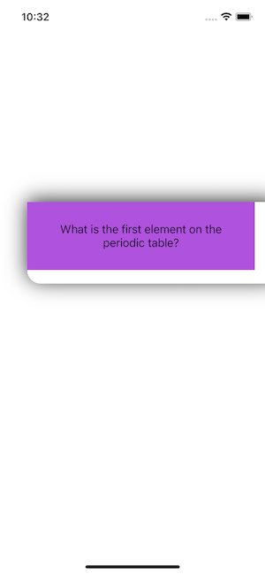
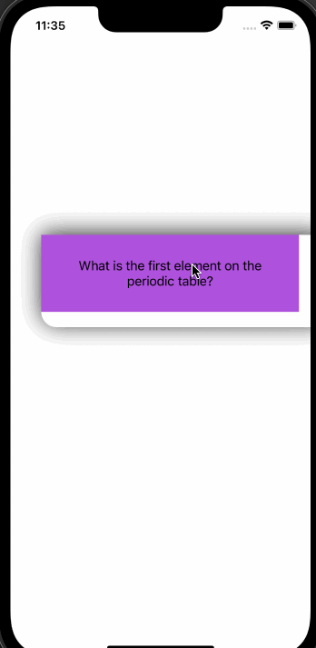

## Lab 1

# FlashCards of chemFlash

#my cards

#My screenshot

📝 `NOTE` Paste this template at the top of your existing `README.md` file from the last lab.

## Lab 2

### App Description
`TODO://` Add app description

### App Walk-though

 
## Required
- [x] User can open the creation screen
- [x] User can cancel out of the creation screen
- [x] User can enter a new question and answer in the creation screen to then show it on the flashcard
- [x] Push code to GitHub
## Optional
- [x] User gets an error if they try to create a new flashcard with no question or answer
- [x] User can edit existing flashcard
- [x] User can add multiple choice answers in the creation screen

## Lab 3

### App Walk-through
![app2.gif]
## Required

## Required
- [x] User can browse through multiple flashcards
- [x] User can re-open the app and see previously created flashcards
- [x] Push code to GitHub
## Optional
- [x] User can delete a flashcard
- [x] User can edit existing flashcard
- [x] User can store multiple choice questions
